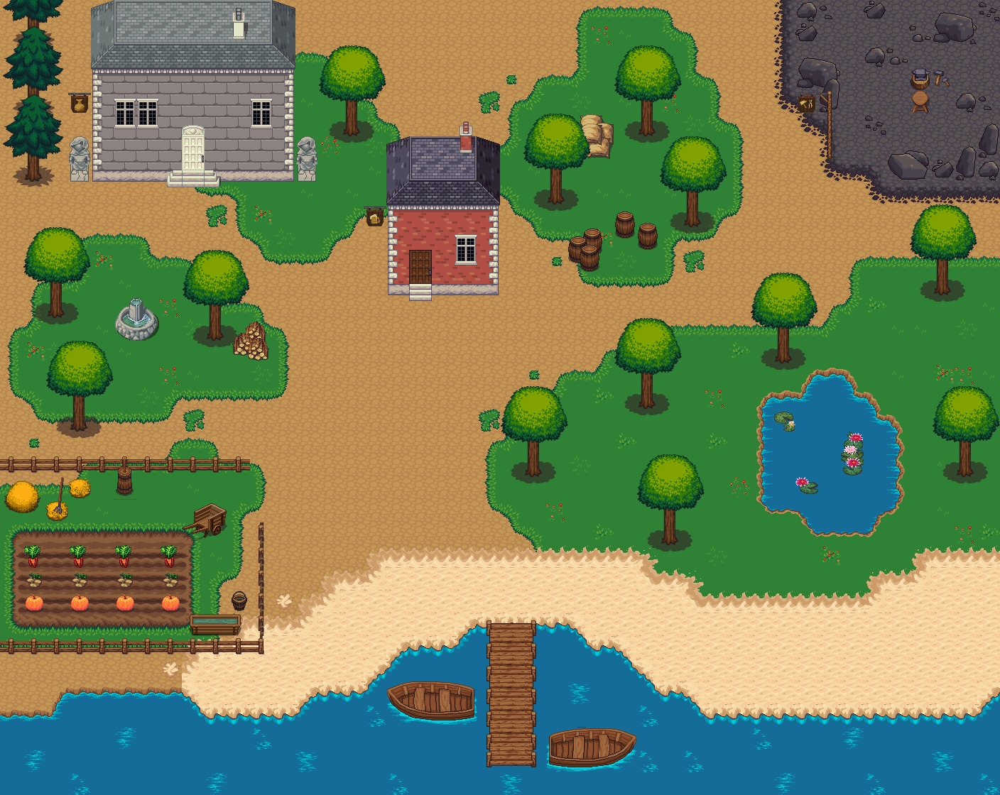

            

#

    <strong>Play CryptOdyssey and raise as much money as possible to become the crypto master!</strong>

  
  

  CryptOdyssey is a game centered around the world of cryptocurrencies. Thanks to trading and the many ways to earn crypto, you will discover the trader in you and perhaps be able to become the richest!

    

 

 

## Table of Contents

1. [Getting Started](#getting-started)
2. [Technologies](#technologies)
3. [Guides and resources](#guides-and-resources)
4. [Authors](#authors)
5. [License](#license)

## Getting Started

### Installing

You will need to follow the steps below in order to run the application :

1. Install the Node.js runtime on your computer. You can find the link to download it under the [Guides and resources](#guides-and-resources) section.
2. Download this repository and unzip it.
3. With a shell (CMD, PowerShell, Bash, etc), navigate to the unzipped folder and execute the `npm install` command.
4. Run the project by executing `npm start`.

Once these four steps have been executed, you will be able to open the URL `http://localhost:3000` in your browser and play **CryptOdyssey** !

## Technologies

The technology used for this project rely entirely on HTML, CSS and JavaScript.

The front-end is made without library. It uses :
- HTML
- CSS
- JavaScript

The back-end uses :
- Node.js
- Express.js
- NeDB

 
## Guides and resources

* [Node.js](https://nodejs.org/) - Server runtime
* [Express.js](https://expressjs.com/) - Web framework
* [NeDB](https://github.com/louischatriot/nedb) - Database
* [CoinGecko API](https://www.coingecko.com/en/api) - Cryptocurrencies Prices API
* [BigDataCloud API](https://www.bigdatacloud.com/geocoding-apis) - Reverse Geocoding API

## Authors

<table width="200px">
   <tbody>
      <tr>
         <td align="center">
            <a href="https://github.com/d-roduit">
             
            Daniel Roduit
            </a>
         </td>
         <td align="center">
            <a href="https://gitlab.com/g.cathy">
             
            Cathy Gay
            </a>
         </td>
        <td align="center" valign="top">
            <a href="https://gitlab.com/Henrick_Neads">
             
            Henrick Neads
            </a>
         </td>
      </tr>
   </tbody>
</table>

## License

This project is licensed under the MIT License
